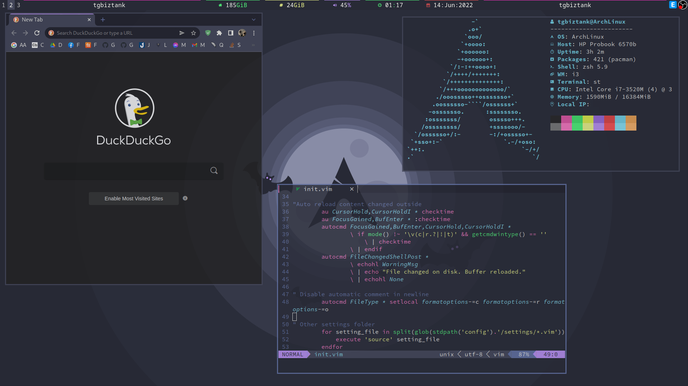

<h1 align="center"></h1>
<h2 align="center">tgbiztank's complete Arch Linux setup</h2>

<a href="#infor">Information</a> - <a href="#install">Install</a> - <a href="#key">Keyboard
		shortcuts</a> - <a href="https://facebook.com/tgbiztank">Facebook</a>

<h2 align="center">Preview</h2>

<a href="https://raw.githubusercontent.com/tgbiztank/dotfiles/main/preview.png"><a>

<h3 id="infor">1.Information</h3>

This repo was created to archive and save time during my arch installation. Some people requested that I make a full
	page about it, so here it is! 

<ul>
	<li>
		<strong>OS</strong>: <a href="https://archlinux.org/download/">Arch Linux</a>
	</li>
	<li>
		<strong>WM</strong>: <a href="https://i3wm.org/downloads/">i3-gaps</a>
	</li>
	<li>
		<strong>Terminal</strong>: <a href="https://github.com/gnome-terminator/terminator">Terminator</a>
	</li>
	<li>
		<strong>Editor</strong>: <a href="https://github.com/neovim/neovim/">Neovim</a>
	</li>
	<li>
		<strong>File Manager</strong>: <a href="http://wiki.lxde.org/en/PCManFM">PCManFM</a>
	</li>
	<li>
		<strong>Browser</strong>: <a href="https://www.google.com/chrome/index.html">Chrome</a>
	</li>
	<li>
		<strong>Shell</strong>: <a href="https://sourceforge.net/projects/zsh/files/latest/download">Zsh</a>
	</li>
</ul>
<h6 align="center"><b>Chrome, PCManFM, and Terminator are my top picks because they're easy to set up and use =))</b>
</h6>
<h3 id="install">2.Install</h3>

Install by following the commands:

<h6>(Make sure you are using Linux)</h6>
<pre><code>cd ~
git clone https://github.com/tgbiztank/dotfiles.git
cd dotfiles/script
chmod +x install.sh
./install.sh
</code></pre>
<h3 id="key">3.Keybinds</h3>
<h3 id="--list">- List:</h3>
<ul align="left">
	<li>
		<a href="#i3-gaps"><strong>i3-gaps</strong>:</a>
		<ul>
			<li>
				<a href="#1windows-manager"><strong>1.Windows manager</strong></a>
				<ul>
					<li>
						<a href="#1focus"><strong>1.1.Focus</strong></a>
					</li>
					<li>
						<a href="#2move"><strong>1.2.Move</strong></a>
					</li>
					<li>
						<a href="#3resize"><strong>1.3.Resize</strong></a>
					</li>
				</ul>
			</li>
			<li>
				<a href="#2launch-program"><strong>2.Launch program</strong></a>
			</li>
			<li>
				<a href="#3other-shortcuts"><strong>3.Other shortcuts</strong></a>
			</li>
		</ul>
	</li>
</ul>
<ul align="left">
	<li>
		<a href="#nvim"><strong>Neovim</strong></a>
	</li>
	<ul>
		<li>
			<a href="#kvim"><strong>Keybinds</strong></a>
		</li>
	</ul>
</ul>
<h3 id="i3-gaps">i3-gaps</h3>
<h4 id="1windows-manager">1.Windows manager</h4>
<h5 id="1focus">1.Focus</h5>
<table>
	<thead>
		<tr>
			<th align="center"><strong>-</strong></th>
			<th align="center"><strong>Keybinds</strong></th>
			<th align="center"><strong>Actions</strong></th>
		</tr>
	</thead>
	<tbody>
		<tr>
			<td align="center"><strong>1.1</strong></td>
			<td align="center"><kbd>Super + K</kbd></td>
			<td align="center">Focus top</td>
		</tr>
		<tr>
			<td align="center"><strong>1.2</strong></td>
			<td align="center"><kbd>Super + J</kbd></td>
			<td align="center">Focus bottom</td>
		</tr>
		<tr>
			<td align="center"><strong>1.3</strong></td>
			<td align="center"><kbd>Super + H</kbd></td>
			<td align="center">Focus left</td>
		</tr>
		<tr>
			<td align="center"><strong>1.4</strong></td>
			<td align="center"><kbd>Super + L</kbd></td>
			<td align="center">Focus right</td>
		</tr>
	</tbody>
</table>
<h5 id="2move">2.Move</h5>
<table>
	<thead>
		<tr>
			<th align="center"><strong>-</strong></th>
			<th align="center"><strong>Keybinds</strong></th>
			<th align="center"><strong>Actions</strong></th>
		</tr>
	</thead>
	<tbody>
		<tr>
			<td align="center"><strong>2.1</strong></td>
			<td align="center"><kbd>Super + W</kbd></td>
			<td align="center">Up</td>
		</tr>
		<tr>
			<td align="center"><strong>2.2</strong></td>
			<td align="center"><kbd>Super + S</kbd></td>
			<td align="center">Down</td>
		</tr>
		<tr>
			<td align="center"><strong>2.3</strong></td>
			<td align="center"><kbd>Super + A</kbd></td>
			<td align="center">Left</td>
		</tr>
		<tr>
			<td align="center"><strong>2.4</strong></td>
			<td align="center"><kbd>Super + D</kbd></td>
			<td align="center">Right</td>
		</tr>
	</tbody>
</table>
<h5 id="3resize">3.Resize</h5>
<table>
	<thead>
		<tr>
			<th align="center"><strong>-</strong></th>
			<th align="center"><strong>Keybinds</strong></th>
			<th align="center"><strong>Actions</strong></th>
		</tr>
	</thead>
	<tbody>
		<tr>
			<td align="center"><strong>3.1</strong></td>
			<td align="center"><kbd>Super + Shift + W</kbd></td>
			<td align="center">Grow height</td>
		</tr>
		<tr>
			<td align="center"><strong>3.2</strong></td>
			<td align="center"><kbd>Super + Shift + S</kbd></td>
			<td align="center">Shrink height</td>
		</tr>
		<tr>
			<td align="center"><strong>3.3</strong></td>
			<td align="center"><kbd>Super + Shift + A</kbd></td>
			<td align="center">Grow width</td>
		</tr>
		<tr>
			<td align="center"><strong>3.4</strong></td>
			<td align="center"><kbd>Super + Shift + D</kbd></td>
			<td align="center">Shrink width</td>
		</tr>
		<tr>
			<td align="center"><strong>3.5</strong></td>
			<td align="center"><kbd>Super + "+"</kbd></td>
			<td align="center">Zoom in</td>
		</tr>
		<tr>
			<td align="center"><strong>3.6</strong></td>
			<td align="center"><kbd>Super + "-"</kbd></td>
			<td align="center">Zoom out</td>
		</tr>
	</tbody>
</table>
<h5 id="4workspace">4.Workspace</h5>
<table>
	<thead>
		<tr>
			<th align="center"><strong>-</strong></th>
			<th align="center"><strong>Keybinds</strong></th>
			<th align="center"><strong>Actions</strong></th>
		</tr>
	</thead>
	<tbody>
		<tr>
			<td align="center"><strong>4.1</strong></td>
			<td align="center"><kbd>Super + 1</kbd></td>
			<td align="center">Move to workspace 1</td>
		</tr>
		<tr>
			<td align="center"><strong>4.2</strong></td>
			<td align="center"><kbd>Super + 2</kbd></td>
			<td align="center">Move to workspace 2</td>
		</tr>
		<tr>
			<td align="center"><strong>4.3</strong></td>
			<td align="center"><kbd>Super + 3</kbd></td>
			<td align="center">Move to workspace 3</td>
		</tr>
		<tr>
			<td align="center"><strong>4.4</strong></td>
			<td align="center"><kbd>Super + Shift + 1</kbd></td>
			<td align="center">Move windows to workspace 1</td>
		</tr>
		<tr>
			<td align="center"><strong>4.5</strong></td>
			<td align="center"><kbd>Super + Shift + 2</kbd></td>
			<td align="center">Move windows to workspace 2</td>
		</tr>
		<tr>
			<td align="center"><strong>4.6</strong></td>
			<td align="center"><kbd>Super + Shift + 3</kbd></td>
			<td align="center">Move windows to workspace 3</td>
		</tr>
	</tbody>
</table>
<h5 id="5other">5.Other</h5>
<table>
	<thead>
		<tr>
			<th align="center"><strong>-</strong></th>
			<th align="center"><strong>Keybinds</strong></th>
			<th align="center"><strong>Actions</strong></th>
		</tr>
	</thead>
	<tbody>
		<tr>
			<td align="center"><strong>5.1</strong></td>
			<td align="center"><kbd>F11</kbd></td>
			<td align="center">Full screen</td>
		</tr>
		<tr>
			<td align="center"><strong>5.2</strong></td>
			<td align="center"><kbd>Print</kbd></td>
			<td align="center">Screen capture</td>
		</tr>
		<tr>
			<td align="center"><strong>5.3</strong></td>
			<td align="center"><kbd>Super + Tab</kbd></td>
			<td align="center">Show hidden window</td>
		</tr>
		<tr>
			<td align="center"><strong>5.4</strong></td>
			<td align="center"><kbd>Super + X</kbd></td>
			<td align="center">Hide curent windows</td>
		</tr>
		<tr>
			<td align="center"><strong>5.5</strong></td>
			<td align="center"><kbd>Alt + Tab</kbd></td>
			<td align="center">Floating windows</td>
		</tr>
		<tr>
			<td align="center"><strong>5.6</strong></td>
			<td align="center"><kbd>Alt + F4</kbd></td>
			<td align="center">Close windows</td>
		</tr>
		<tr>
			<td align="center"><strong>5.7</strong></td>
			<td align="center"><kbd>Super + Shift + R</kbd></td>
			<td align="center">Reload i3</td>
		</tr>
		<tr>
			<td align="center"><strong>5.8</strong></td>
			<td align="center"><kbd>Super + Shift + E</kbd></td>
			<td align="center">Logout</td>
		</tr>
	</tbody>
</table>
<h4 id="2launch-program">2.Launch program</h4>
<table>
	<thead>
		<tr>
			<th align="center"><strong>-</strong></th>
			<th align="center"><strong>Keybinds</strong></th>
			<th align="center"><strong>Actions</strong></th>
		</tr>
	</thead>
	<tbody>
		<tr>
			<td align="center"><strong>1.1</strong></td>
			<td align="center"><kbd>Super + F</kbd></td>
			<td align="center">Search bar</td>
		</tr>
		<tr>
			<td align="center"><strong>1.2</strong></td>
			<td align="center"><kbd>Super + R</kbd></td>
			<td align="center">Terminal</td>
		</tr>
		<tr>
			<td align="center"><strong>1.3</strong></td>
			<td align="center"><kbd>Super + G</kbd></td>
			<td align="center">Browser</td>
		</tr>
		<tr>
			<td align="center"><strong>1.4</strong></td>
			<td align="center"><kbd>Super + E</kbd></td>
			<td align="center">Files manager</td>
		</tr>
	</tbody>
</table>
<h4 id="3other-shortcuts">3.Other shortcuts</h4>
<table>
	<thead>
		<tr>
			<th align="center"><strong>-</strong></th>
			<th align="center"><strong>Keybinds</strong></th>
			<th align="center"><strong>Actions</strong></th>
		</tr>
	</thead>
	<tbody>
		<tr>
			<td align="center"><strong>1.1</strong></td>
			<td align="center"><kbd>Super + F1</kbd></td>
			<td align="center">Fix sounds</td>
		</tr>
		<tr>
			<td align="center"><strong>1.2</strong></td>
			<td align="center"><kbd>Alt + F1</kbd></td>
			<td align="center">Volume switch:ON/OFF</td>
		</tr>
		<tr>
			<td align="center"><strong>1.3</strong></td>
			<td align="center"><kbd>Alt + F2</kbd></td>
			<td align="center">Volume down</td>
		</tr>
		<tr>
			<td align="center"><strong>1.4</strong></td>
			<td align="center"><kbd>Alt + F3</kbd></td>
			<td align="center">Volume up</td>
		</tr>
		<tr>
			<td align="center"><strong>1.5</strong></td>
			<td align="center"><kbd>Alt + 1</kbd></td>
			<td align="center">Disable transparent</td>
		</tr>
		<tr>
			<td align="center"><strong>1.6</strong></td>
			<td align="center"><kbd>Alt + 2</kbd></td>
			<td align="center">Disable transparent curent focus</td>
		</tr>
		<tr>
			<td align="center"><strong>1.7</strong></td>
			<td align="center"><kbd>Alt + 3</kbd></td>
			<td align="center">Enable transparent for all focus</td>
		</tr>
	</tbody>
</table>
<h3 id="nvim">Neovim</h3>

I'm too lazy to add more nvim keyboard shortcuts because writing a table menu in HTML is so bruh. If you want to
	check it out or make changes, open a terminal window and paste the commands below into it.

<pre><code>
        nvim ~/.config/nvim/settings/keybinds.vim
        </code></pre>
<h3 id="4final">4.Final</h3>
<h4 align="center">Thanks for visiting my repository</h4>

I'm too lazy to write more so I'll stop here. Bye, have a nice day 
	Thanks to: <a href="https://github.com/dracula/dracula-theme/">Dracula Theme</a>

